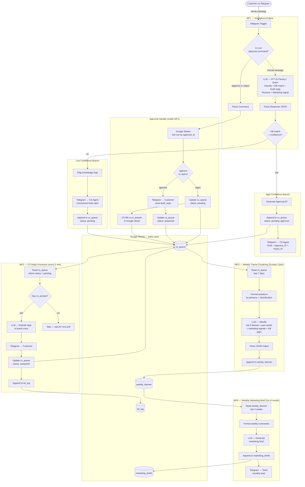
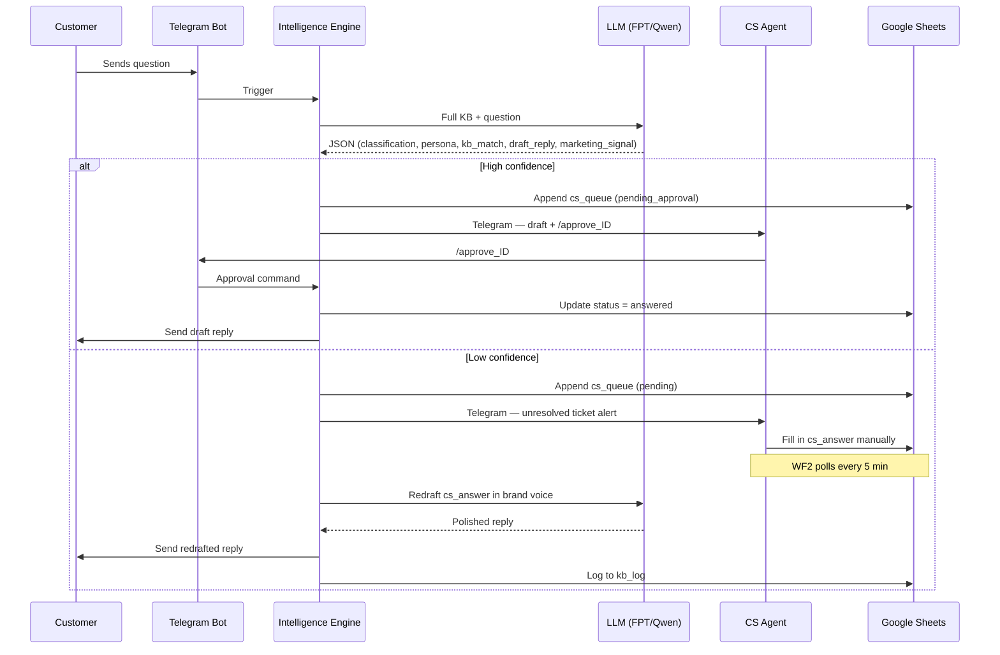

# Boldr Intelligence Engine — System Architecture

## Full System Flow



---

## Data Flow per Ticket



---

## LLM Output Schema

Every customer message produces a single structured JSON object:

```json
{
  "classification": "engraving | servicing | product | orders | cs_operations | out_of_scope",
  "buyer_persona": "Gift Buyer | Health-Conscious Buyer | Enthusiast | Active Buyer | Sustainability Advocate | General",
  "kb_match": "yes | no",
  "confidence_score": 0.0,
  "draft_reply": "Brand-voiced reply to the customer",
  "summary": "One-line internal summary of the question",
  "marketing_signal": "Potential marketing insight from this question",
  "marketing_flag": "yes | no"
}
```

---

## Google Sheet Structure

| Tab | Columns |
|---|---|
| `cs_queue` | `id, chat_id, customer_name, question, persona, draft_reply, cs_answer, status, timestamp` |
| `kb_log` | `id, question, cs_answer, drafted_reply, timestamp` |
| `weekly_themes` | `week, theme_1–5, top_pain_point, kb_gaps, marketing_signals, total_tickets` |
| `marketing_briefs` | `month, brief_text, generated_at` |
